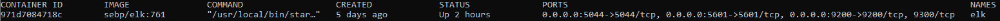

# CyberSecBootCamp-Project1
My Project 1 for the University of Minnesota Cyber Security Boot Camp

## Automated ELK Stack Deployment

The files in this repository were used to configure the network depicted below.

These files have been tested and used to generate a live ELK deployment on Azure. They can be used to either recreate the entire deployment pictured above. Alternatively, select portions of the \*_playbook.yml file may be used to install only certain pieces of it, such as Filebeat.

This document contains the following details:
- Description of the Topology
- Access Policies
- ELK Configuration
  - Beats in Use
    - Machines Being Monitored
    - How to Use the Ansible Build

    ### Description of the Topology

    The main purpose of this network is to expose a load-balanced and monitored instance of DVWA, the D\*mn Vulnerable Web Application.

    Load balancing ensures that the application will be highly available, in addition to restricting access to the network.

    Integrating an ELK server allows users to easily monitor the vulnerable VMs for changes to the logs and system availability.

    The configuration details of each machine may be found below.

    | Name     | Function | IP Address | Operating System |
    |----------|----------|------------|------------------|
    | Jump Box | Gateway  | 10.0.0.4   | Linux            |
    | ELK-SRV  | ELK stack for monitoring | 10.1.0.4            | Linux                 |
    | WEB-1     | DVWA server         | 10.0.0.5           |      Linux            |
    | WEB-2     | DVWA server         | 10.0.0.6           |    Linux              |
    | WEB-3     | DVWA server         | 10.0.0.7           |    Linux              |

    ### Access Policies

    The machines on the internal network are not exposed to the public Internet. 

    Only the ELK-SRV machine can accept connections from the Internet. Access to this machine is only allowed from the following IP addresses: (my home IP address)

    Machines within the network can only be accessed by the Jump Box (10.0.04.).

    A summary of the access policies in place can be found in the table below.

    | Name     | Publicly Accessible | Allowed IP Addresses |
    |----------|---------------------|----------------------|
    | Jump Box | No              | (home IP)    |
    | ELK-SRV  | No                    | (home IP)                     |
    | WEB-1         |      Yes (through load balancer)               |  10.0.0.4                    |
    | WEB-2         |      Yes (through load balancer)               |  10.0.0.4                    |
    | WEB-3         |      Yes (through load balancer)               |  10.0.0.4                    |

    ### Elk Configuration

    Ansible was used to automate configuration of the ELK machine. No configuration was performed manually, which is advantageous because it reduces duplication and human error. 

    The playbook implements the following tasks:
    - Install Docker and related packages
    - Increase virtual memory (needed for Elasticsearch)
    - Install and enable the "sebp/elk:761" docker container 

    The following screenshot displays the result of running `docker ps` after successfully configuring the ELK instance.

    

    ### Target Machines & Beats
    This ELK server is configured to monitor the following machines:
    - WEB-1 (10.0.0.5)
    - WEB-2 (10.0.0.6)
    - WEB-3 (10.0.0.7)

    We have installed the following Beats on these machines:
    - Filebeat
    - Metricbeat

    These Beats allow us to collect the following information from each machine:
    - Filebeat collects system logs, allowing us to see events in those logs
    - Metricbeat collects metrics data, allowing us to see system statistics such as uptime and load

    ### Using the Playbook
    In order to use the playbook, you will need to have an Ansible control node already configured. Assuming you have such a control node provisioned: 

    SSH into the control node and follow the steps below:
    - Copy the \*_playbook.yml files to the Ansible Docker image.
    - Update the Ansible hosts (/etc/ansible/hosts) file to include the IP address of your ELK server and the IP addresses of the web servers.
    - Run the playbook, and navigate to <ELK server IP>:5601 to check that the installation worked as expected.
